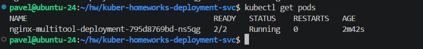
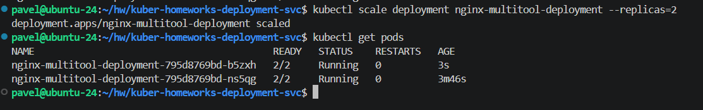
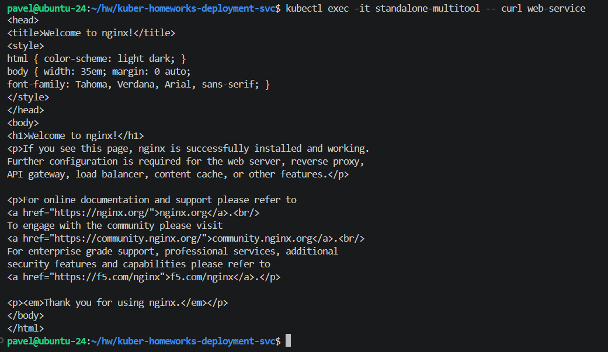

# Домашнее задание к занятию «`Запуск приложений в K8S`» - `Рыбянцев Павел`

------

Репозиторий содержит манифесты и отчёт о выполнении домашнего задания. Кластер развернут локально с помощью MicroK8s.

---

## Задание 1. Создать Deployment и обеспечить доступ к репликам приложения из другого Pod

### Исходные файлы:
* Манифест деплоймента: [task1/deployment.yaml](task1/deployment.yaml)
* Манифест сервиса: [task1/service.yaml](task1/service.yaml)
* Манифест тестового пода: [task1/multitool-pod.yaml](task1/multitool-pod.yaml)

### Описание решения:
1. Был создан Deployment с двумя контейнерами: `nginx` и `multitool`. 
2. **Решение ошибки портов:** По умолчанию оба контейнера пытаются занять порт `80`. Для устранения конфликта порт контейнера `multitool` был переопределен на `8080` с помощью переменной окружения `HTTP_PORT`.
3. Масштабирование деплоймента до 2 реплик выполнено командой:
   ```bash
   kubectl scale deployment nginx-multitool-deployment --replicas=2
   ```

### Проверка работоспособности:

Вывод подов до:


После масштабирования:



Проверка доступности реплик через `curl` из независимого пода `standalone-multitool`:
```bash
kubectl exec -it standalone-multitool -- curl web-service
```


---

## Задание 2. Создать Deployment и обеспечить старт основного контейнера при выполнении условий

### Исходные файлы:
* Манифест деплоймента с Init-контейнером: [task2/nginx-init-deployment.yaml](task2/nginx-init-deployment.yaml)
* Манифест сервиса приложения: [task2/nginx-init-svc.yaml](task2/nginx-init-svc.yaml)

### Описание решения:
1. Создан Deployment приложения `nginx` с Init-контейнером на базе официального образа `busybox:latest`.
2. В Init-контейнер заложена циклическая проверка регистрации **сервиса этого приложения** (`nginx-init-svc`) в DNS-кластере.
3. **Решение особенности утилиты nslookup:** В сборках `busybox` утилита `nslookup` из-за перебора локальных поисковых суффиксов возвращает код ошибки даже при успешном поиске объекта, что зацикливает контейнер. Чтобы проверка срабатывала строго при появлении целевого сервиса, вывод фильтруется по ключевому слову `Name:`, которое генерируется CoreDNS только при успешном резолве имени:
   ```yaml
   command: ['sh', '-c', 'until nslookup nginx-init-svc 2>&1 | grep -q "Name:"; do echo waiting for nginx-init-svc; sleep 2; done;']
   ```
4. Основной контейнер `nginx` не запускается, пока Init-контейнер не завершит свою работу.

### Проверка работоспособности:
Состояние пода **ДО** запуска сервиса (ожидание в режиме Init):


Состояние пода **ПОСЛЕ** создания и запуска сервиса:
